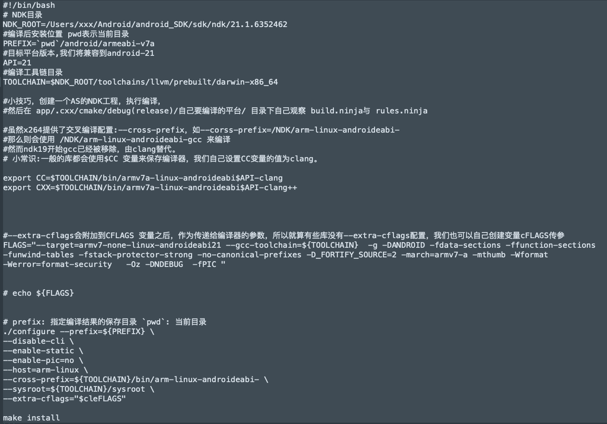

# Demo 实现步骤
## 第一步 引入rtmp
  rtmp 是协议 相当于http协议  本Demo 需要实现推流 在使用rtmp协议的同时 使用推流工具rtmpdump 相当与http对应的工具httpConnect
- 下载rtmpdump
  http://rtmpdump.mplayerhq.hu/download/
  
- 解压下载的包
  找到librtmp文件夹 连同包一起copy到cpp目录下
  
- librtmp新建 CMakeList.txt
  在CMakeList.txt 中引入rtmp资源 生成动态库
  
## 第二步 编译x264 生成静态.a 文件
- 下载 x264
  git clone https://code.videolan.org/videolan/x264.git
  下载之后 进入 x264 文件目录
  ls 查看configure配置文件帮助文档
    
- 自定义一个sh脚本
  配置必要参数
    
- 执行自定义脚本
- copy 对应平台的静态文件到项目中 
    放入到cpp文件目录下 新建功能包 在新包下放入文件
  
- 引入静态文件 在CMakeList中

## 第三步使用camerax 获取图像信息

  